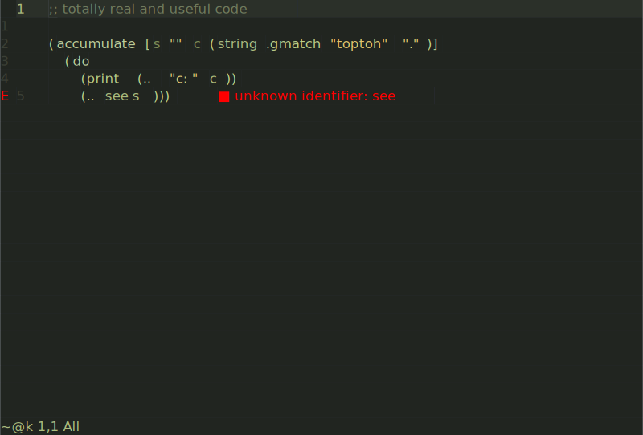

<div align="center">

</div>

# 🍲 Hotpot

> You take this home, throw it in a pot, add some broth, some neovim... baby,
> you got a stew going!
>
> ~ Fennel Programmers (probably)

Hotpot is a [Fennel](https://fennel-lang.org/) compiler plugin for Neovim. Just
`(require :my-fennel)` and Hotpot does the cooking for you 🍻. Seamlessly mix
and match Fennel and Lua as little or as much as you want. Your Fennel code is
only compiled when it (or a dependency such as a macro) are changed and
everything is stored in a bytecode cache for super fast startup time. It can do
ahead of time compilation too :floppy_disk:.

```fennel
;; ~/.config/nvim/fnl/is_neat.fnl
;; put your fennel code in fnl/
(fn [what] (print what "is neat!"))
```

```lua
-- and require it like normal in your lua file
local neat = require('is_neat') -- compiled & cached on demand
neat("fennel") -- => "fennel is neat!"
```

<div align="center">
<p align="center">
  
</p>
</div>

### *New in 0.5.2! 🍩 Improved diagnostics! 🍾 [Compiler plugin support!](COOKBOOK.md#compiler-plugins)*

## TOC

- [Requirements](#requirements)
- [Install](#install)
- [Setup](#setup)
- [Cookbook - common questions and usage guides](COOKBOOK.md)
- [API](#api)
- [How does Hotpot work?](#how-does-hotpot-work)
- [Windows](#windows)
- [Change Log](CHANGELOG.md)

## Requirements

- Neovim 0.7.2+
- ~~Fanatical devotion to parentheses.~~

## Install

Hotpot can be installed via any package manager but you may prefer to manually
*install* it and let your package manager *update* it. This allows you to
configure your package manager with Fennel.

You must call `require("hotpot")` before you attempt to require any Fennel
files. If you do not do this manually, Neovim will call it for you but the
order and time that this occurs can be non-deterministic.

If you only want to experiment with Fennel, adding `rktjmp/hotpot.nvim` to your
plugin manager is probably good enough.

<details>
<summary>Automatic Install & Update (Recommended)</summary>

```lua
-- ~/.config/nvim/init.lua

-- This init.lua file will clone hotpot into your plugins directory if
-- it is missing. Do not forget to also add hotpot to your plugin manager
-- or it may uninstall hotpot!

-- Consult your plugin-manager documentation for where it installs plugins.
-- packer.nvim
-- local hotpot_path = vim.fn.stdpath('data') .. '/site/pack/packer/start/hotpot.nvim'
-- paq.nvim
local hotpot_path = vim.fn.stdpath('data') .. '/site/pack/paqs/start/hotpot.nvim'

if vim.fn.empty(vim.fn.glob(hotpot_path)) > 0 then
  print("Could not find hotpot.nvim, cloning new copy to", hotpot_path)
  vim.fn.system({'git', 'clone',
                 'https://github.com/rktjmp/hotpot.nvim', hotpot_path})
  vim.cmd("helptags " .. hotpot_path .. "/doc")
end

-- Enable fnl/ support
require("hotpot")

-- Now you can load fennel code, so you could put the rest of your
-- config in a separate `~/.config/nvim/fnl/my_config.fnl` or
-- `~/.config/nvim/fnl/plugins.fnl`, etc.
require("my_config")
```

</details>

<details>
<summary>Plugin Managers</summary>

```lua
-- example using paq.nvim
require "paq" {
  "rktjmp/hotpot.nvim"
}
```

</details>

<details>
<summary>Want to use an unreleased version of Fennel?</summary>

The `nightly` branch merges Fennel `HEAD` into Hotpot each day.

The main purpose of this is to run the test suite against upcoming releases.
If the test suite fails, the changes will not be merged, so it should be
reasonably stable to use day-to-day.

Because the `nightly` branch's primary purpose is to run tests, there is no
guarantee that it wont be recreated, renamed or force-pushed onto at some point
in the future, which would require you do manually force pull or create a fresh
clone.

For a preview of upcoming Fennel features, you can view the
[changelog](https://git.sr.ht/~technomancy/fennel/tree/main/item/changelog.md).

</details>

<details>
<summary>Windows</summary>

Windows installations may [require additional setup](#windows) depending on
your account privileges.

</details>

## Setup

Hotpot accepts the following configuration options, with defaults as shown.

You do not have to call setup *unless you are altering a default option*.

See `h: hotpot-setup` for more details.

```lua
require("hotpot").setup({
  -- allows you to call `(require :fennel)`.
  -- recommended you enable this unless you have another fennel in your path.
  -- you can always call `(require :hotpot.fennel)`.
  provide_require_fennel = false,
  -- show fennel compiler results in when editing fennel files
  enable_hotpot_diagnostics = true,
  -- compiler options are passed directly to the fennel compiler, see
  -- fennels own documentation for details.
  compiler = {
    -- options passed to fennel.compile for modules, defaults to {}
    modules = {
      -- not default but recommended, align lua lines with fnl source
      -- for more debuggable errors, but less readable lua.
      -- correlate = true
    },
    -- options passed to fennel.compile for macros, defaults as shown
    macros = {
      env = "_COMPILER", -- MUST be set along with any other options
      -- you may wish to disable fennels macro-compiler sandbox in some cases,
      -- this allows access to tables like `vim` or `os` inside macro functions.
      -- See fennels own documentation for details on these options.
      -- compilerEnv = _G,
      -- allowGlobals = false,
    }
  }
})
```

## Cookbook

See the [Hotpot Cookbook](COOKBOOK.md) for guides and examples about [Hotpot
Reflect](COOKBOOK.md#using-hotpot-reflect), [using the
API](COOKBOOK.md#using-the-api), [ahead of time
compilation](COOKBOOK.md#ahead-of-time-compilation),
[commands](COOKBOOK.md#commands), etc.

## API

Hotpot provides a number of functions for evaluating and compiling Fennel code,
including helpers to easily operate on strings, selections and buffers for
example.

For complete details, see [`:h hotpot-api`](doc/hotpot-api.txt) and [Using the
API](COOKBOOK.md#using-the-api).

## How does Hotpot work?

Hotpot has three main systems, the lua cache, the bytecode cache and the
module loader.

The lua cache contains our compiled fennel code. When requiring a fennel
module, we must first compile that fennel code into lua, then save the result
to disk. This allows the user to easily view the result of the compilation for
debugging. See `:h hotpot.api.cache`.

The bytecode cache is a special file (normally called the `index`), loaded
into memory when Neovim starts. It contains the machine readable code for
every module that Neovim has previously loaded. By caching modules in-memory
and in a machine readable format, we can find and resolve modules very quickly
as most of the "heavy lifting" is already done. By maintaining a bytecode
cache we can achieve up to 15x performance increases.

The bytecode cache contains information about when the cache was created for
each module, so any modifications made to the original source files or
dependencies can be detected and reloaded into the cache.

The module loader will find and load lua (or fennel) modules. First it will
search the `index` and then Neovims runtime path for source files that match
the requested module name. If a source file is found, it is compiled to lua
(if needed), then the bytecode is saved to the `index`, then the module is
returned to the user.

As an example, given `require("my.module")` Hotpot will check the following
locations, in order, and return the first match.

- `index`
- `$RUNTIMEPATH/lua/my/module.lua`
- `$RUNTIMEPATH/lua/my/module/init.lua`
- `$RUNTIMEPATH/fnl/my/module.fnl`
- `$RUNTIMEPATH/fnl/my/module/init.fnl`
- `<package.path>/my/module.lua`
- `<package.path>/my/module.fnl`

You can see that it will preference a bytecode cache, then `.lua` files over
`.fnl`, if they exist.

## Windows

Hotpot must be able to create symlinks for some core functionality which
Windows may disallow by default, depending on your account type and Windows
version.

To enable symlink creation without elevated privileges, you may have to enable
"Developer Mode" in your account settings.

See ["Enable your device for
development"](https://docs.microsoft.com/en-us/windows/apps/get-started/enable-your-device-for-development)
and ["Symlinks in Windows
10"](https://blogs.windows.com/windowsdeveloper/2016/12/02/symlinks-windows-10/).

## License

Hotpot embeds `fennel.lua`, see `lua/hotpot/fennel.lua` for licensing
information.
